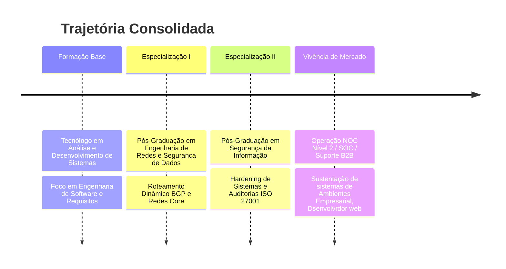

# 👋 Olá, eu sou o **Flávio Vinício Mota da Silva**
### **Analista e Desenvolvedor de Sistemas** | Especialista em Redes & Cybersecurity

<p align="left">
  <a href="https://linkedin.com" target="_blank">
    
  </a>
  <a href="https://youtube.com" target="_blank">
    
  </a>
  <a href="https://udemy.com" target="_blank">
    
  </a>
  <a href="mailto:seu-email@dominio.com">
    
  </a>
</p>

---

## 📌 Perfil Profissional
Engenheiro de Software com sólida trajetória focada na convergência entre o desenvolvimento de sistemas complexos, arquitetura de redes estruturadas e segurança cibernética corporativa. Atuação estratégica baseada em engenharia de requisitos rigorosa, análise preditiva de falhas e blindagem de ambientes digitais (*hardening*). Especialista em projetar, codificar e sustentar ecossistemas de alta disponibilidade, unindo governança de TI e metodologias ágeis para entregar soluções de software seguras de ponta a ponta.

---

## 🗺️ Timeline de Evolução Profissional



---

## 📊 Dashboards de Habilidades (Telemetry Style)

### 🛠️ Hard Skills Dashboard
```text
Análise e Desenvolvimento de Sistemas[████████████████████████████████████████----------------] 80%
Engenharia de Redes                  [████████████████████████████████████████████------------] 85%
Infraestrutura Lógica e Física       [████████████████████████████████████████████------------] 85%
Segurança da Informação & Hardening  [████████████████████████████████████████----------------] 80%
Modelagem de Banco de Dados          [████████████████████████████████████--------------------] 70%
Cloud Computing (AWS / Azure)        [██████████████████████████████--------------------------] 60%
Práticas DevSecOps                   [██████████████████████████████--------------------------] 60%
```

### 🧠 Soft Skills Dashboard
```text
Pensamento Analítico                 [███████████████████████████████████████████████████-----] 95%
Resolução de Problemas Complexos     [████████████████████████████████████████████████--------] 90%
Aprendizado Contínuo (Lifelong)      [███████████████████████████████████████████████████-----] 95%
Comunicação Técnico-Corporativa      [████████████████████████████████████████----------------] 80%
Organização de Processos (Squads)    [███████████████████████████████████████████-----------] 85%
Trabalho em Equipe Multidisciplinar  [███████████████████████████████████████████-----------] 85%
```

---

## 💼 Cards de Escopo e Experiência

<table>
  <tr>
    <td width="50%" valign="top">
      <h3>💻 Engenharia de Software</h3>
      <ul>
        <li><b>Desenvolvimento Web & Back-end:</b> Construção de aplicações sustentáveis sob arquitetura limpa.</li>
        <li><b>Análise de Sistemas:</b> Modelagem estrutural, mapeamento de processos e fluxos de dados lógicos.</li>
        <li><b>Levantamento de Requisitos:</b> Documentação analítica para alinhamento assertivo entre negócio e código.</li>
      </ul>
    </td>
    <td width="50%" valign="top">
      <h3>🌐 Infraestrutura & Operações</h3>
      <ul>
        <li><b>NOC Nível 2 & SOC:</b> Mitigação de incidentes críticos em tempo real e monitoramento analítico de eventos.</li>
        <li><b>Redes Corporativas:</b> Gestão de tráfego, roteamento avançado e provisionamento físico e lógico.</li>
        <li><b>Suporte B2B:</b> Tratamento técnico de alta complexidade para clientes corporativos de larga escala.</li>
      </ul>
    </td>
  </tr>
</table>

## 🛠️ Stack Tecnológica

<div align="center">

### 💻 Linguagens

<p>
  
</p>

### ⚙️ Frameworks e Ferramentas

<p>
  
</p>

### ☁️ Cloud & DevOps

<p>
  
</p>

### 🛡️ Redes e Segurança

<p>
  
  
  
</p>

</div>

---

---

## 🎓 Formação & Certificações Acadêmicas

* 🎓 **Tecnólogo em Análise e Desenvolvimento de Sistemas** — *Graduação Superior de Base Técnica*
* 📜 **Pós-Graduação em Engenharia de Redes e Segurança de Dados** — *Especialização de Infraestrutura Core e Tráfego*
* 📜 **Pós-Graduação em Segurança da Informação** — *Especialização de Governança, Risco e Compliance (GRC)*

---
