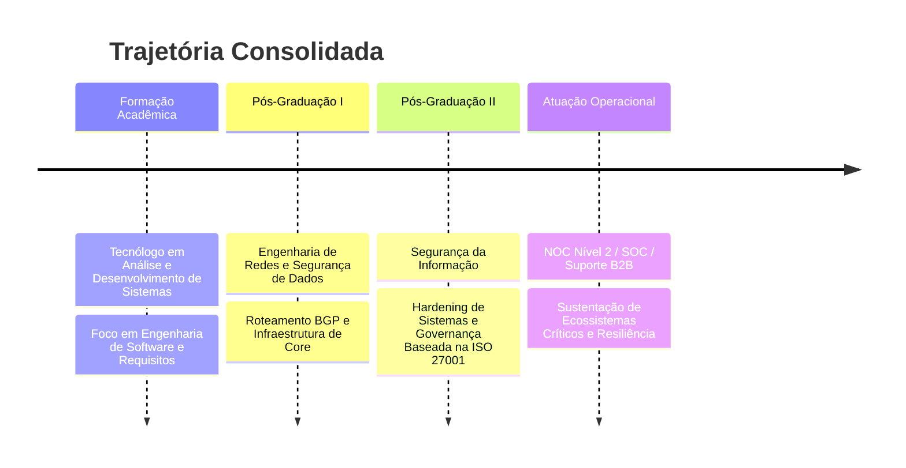

# 👋 Olá, eu sou o **Flávio Vinício Mota da Silva**
### **Analista e Desenvolvedor de Sistemas** 

<p align="left">
  
</p>

---

## 📌 Perfil Profissional
Engenheiro de Software com forte atuação em arquiteturas críticas, segurança de dados e resiliência de infraestrutura lógica. Especializado na construção de sistemas corporativos escaláveis e seguros, integrando práticas modernas de engenharia com metodologias ágeis, conformidade regulatória e governança de TI. Experiência consolidada em operação e sustentação de ambientes de alta disponibilidade, atuando diretamente no desenho e otimização de redes lógicas corporativas complexas.

---

## 📊 Dashboard de Performance Profissional

### 🛠️ Hard Skills
```text
Análise e Desenvolvimento de Sistemas [████████████████████████████████████████----------------] 80%
Engenharia de Redes                  [████████████████████████████████████████████------------] 85%
Infraestrutura Lógica e Física       [████████████████████████████████████████████------------] 85%
Segurança da Informação & Hardening  [████████████████████████████████████████----------------] 80%
Modelagem de Banco de Dados          [████████████████████████████████████--------------------] 70%
Cloud Architecture                   [██████████████████████████████--------------------------] 60%
Práticas DevSecOps                   [██████████████████████████████--------------------------] 60%
```

### 🧠 Soft Skills
```text
Pensamento Analítico                 [███████████████████████████████████████████████████-----] 95%
Resolução de Problemas Complexos     [████████████████████████████████████████████████--------] 90%
Aprendizado Contínuo (Lifelong)      [███████████████████████████████████████████████████-----] 95%
Comunicação Técnico-Corporativa      [████████████████████████████████████████----------------] 80%
Organização de Processos (Squads)    [███████████████████████████████████████████-----------] 85%
Trabalho em Equipe Multidisciplinar  [███████████████████████████████████████████-----------] 85%
```

---

## 🛠️ Ecossistema Tecnológico Corporativo

### 💻 Desenvolvimento & Back-End
`Python` • `Java` • `PHP` • `JavaScript` • `Node.js` • `C++` • `Oracle DB` • `MySQL` • `MongoDB`

### 🌐 Redes & Telecomunicações
`Roteamento Avançado BGP` • `Infraestrutura Core Huawei` • `Ativos GEPON/GPON FiberHome` • `Cabeamento Estruturado Furukawa` • `Cisco Packet Tracer`

### 🛡️ Cybersecurity & SysAdmin
`Kali Linux` • `Hardening de Servidores` • `Ubuntu Server` • `Windows Server` • `Active Directory` • `Nmap` • `Wireshark`

### 📈 Monitoramento & Governance
`Zabbix Enterprise` • `Grafana Dashboards` • `Framework ITIL` • `COBIT` • `ISO 27001 Compliance` • `Adequação LGPD` • `Metodologias Ágeis (Scrum/Kanban)`

---

## 🗺️ Cronograma de Especialização e Escopo



### 💼 Detalhamento Operacional
* **Desenvolvimento Web & Análise de Sistemas:** Engenharia reversa de sistemas, levantamento analítico de requisitos de negócios e modelagem de bancos de dados relacionais e não-relacionais seguros.
* **NOC Avançado (Nível 2) & SOC:** Monitoramento proativo preventivo, identificação e contenção automatizada de anomalias lógicas e mitigação de incidentes de segurança.
* **Infraestrutura e Redes Corporativas:** Provisionamento e gerência de ativos críticos industriais (Huawei e FiberHome), cabeamento estruturado e redes de longa distância BGP.

---

## 📈 Métricas de Engenharia de Software

<p align="left">
  
  
</p>

<p align="left">
  
</p>

---

## 🌟 Projetos Estratégicos em Destaque

1. **🔒 Enterprise DevSecOps Pipeline**
   - Implementação de automações de segurança integradas a esteiras CI/CD para análise estática e correção prévia de vulnerabilidades lógicas em código.
2. **📊 Telemetry Core Engine**
   - Arquitetura de coleta e tratamento de dados de telemetria integrada a APIs de roteadores BGP e ativos ópticos para plotagem dinâmica corporativa.
3. **🛡️ Corporate Hardening Framework**
   - Desenvolvimento de suíte de scripts de auditoria automatizada e mitigação para conformidade estrita com ISO 27001 e diretrizes da LGPD.

---

## 🐍 Git Snake Contribution Map
<p align="left">
  
</p>

---

## 🤝 Conectar Profissionalmente

<p align="left">
  <a href="https://linkedin.com" target="_blank">
    
  </a>
</p>

---
<p align="center">Construído sob padrões internacionais de engenharia e governança corporativa de TI.</p>
