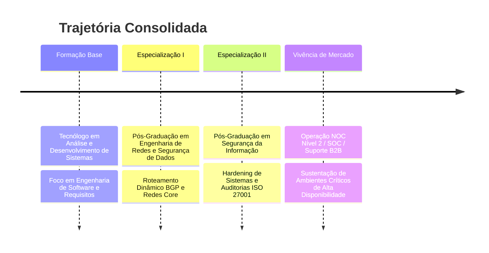

<!-- BANNER MODERN EXECUTIVE -->

  

<!-- TYPING SVG INTERATIVO -->

  

<!-- BOTÕES E BADGES DE CONEXÃO PROFISSIONAL (LINKS FUNCIONAIS) -->

  
  
  
  

---

## 📌 Perfil Profissional
Engenheiro de Software com sólida trajetória focada na convergência entre o desenvolvimento de sistemas complexos, arquitetura de redes estruturadas e segurança cibernética corporativa. Atuação estratégica baseada em engenharia de requisitos rigorosa, análise preditiva de falhas e blindagem de ambientes digitais (*hardening*). Especialista em projetar, codificar e sustentar ecossistemas de alta disponibilidade, unindo governança de TI e metodologias ágeis para entregar soluções de software seguras de ponta a ponta.

---

## 🗺️ Timeline de Evolução Profissional

---

## 📊 Dashboards de Habilidades (Telemetry Style)

### 🛠️ Hard Skills Dashboard

    
    
    
    
    
    
  

### 🧠 Soft Skills Dashboard

    
    
    
    
    
  

---

## 💼 Cards de Escopo e Experiência

<table>
  <tr>
    <td width="50%" valign="top">
      <h3>💻 Engenharia de Software</h3>
      <ul>
        <li><b>Desenvolvimento Web & Back-end:</b> Construção de aplicações sustentáveis sob arquitetura limpa.</li>
        <li><b>Análise de Sistemas:</b> Modelagem estrutural, mapeamento de processos e fluxos de dados lógicos.</li>
        <li><b>Levantamento de Requisitos:</b> Documentação analítica para alinhamento assertivo entre negócio e código.</li>
      </ul>
    </td>
    <td width="50%" valign="top">
      <h3>🌐 Infraestrutura & Operações</h3>
      <ul>
        <li><b>NOC Nível 2 & SOC:</b> Mitigação de incidentes críticos em tempo real e monitoramento analítico de eventos.</li>
        <li><b>Redes Corporativas:</b> Gestão de tráfego, roteamento avançado e provisionamento físico e lógico.</li>
        <li><b>Suporte B2B:</b> Tratamento técnico de alta complexidade para clientes corporativos de larga escala.</li>
      </ul>
    </td>
  </tr>
</table>

---

## 🛠️ Stack Tecnológica de Alta Resolução

<table>
  <tr>
    <td align="center"><b>Linguagens & Back-end</b></td>
    <td>
      
      
      
      
      
      
    </td>
  </tr>
  <tr>
    <td align="center"><b>Dados & Cloud Architecture</b></td>
    <td>
      
      
      
      
      
    </td>
  </tr>
  <tr>
    <td align="center"><b>Segurança & SysAdmin</b></td>
    <td>
      
      
      
      
      
      
    </td>
  </tr>
  <tr>
    <td align="center"><b>Infraestrutura & Telecom</b></td>
    <td>
      
      
      
      
    </td>
  </tr>
  <tr>
    <td align="center"><b>Monitoramento & Governança</b></td>
    <td>
      
      
      
      
    </td>
  </tr>
  <tr>
    <td align="center"><b>Compliance & Frameworks</b></td>
    <td>
      
      
      
      
      
    </td>
  </tr>
</table>

---

## 🎓 Formação & Certificações Acadêmicas

* 🎓 **Tecnólogo em Análise e Desenvolvimento de Sistemas** — *Graduação Superior de Base Técnica*
* 📜 **Pós-Graduação em Engenharia de Redes e Segurança de Dados** — *Especialização de Infraestrutura Core e Tráfego*
* 📜 **Pós-Graduação em Segurança da Informação** — *Especialização de Governança, Risco e Compliance (GRC)*

---

## 📈 GitHub Analytics (Métricas do Desenvolvedor)

  
