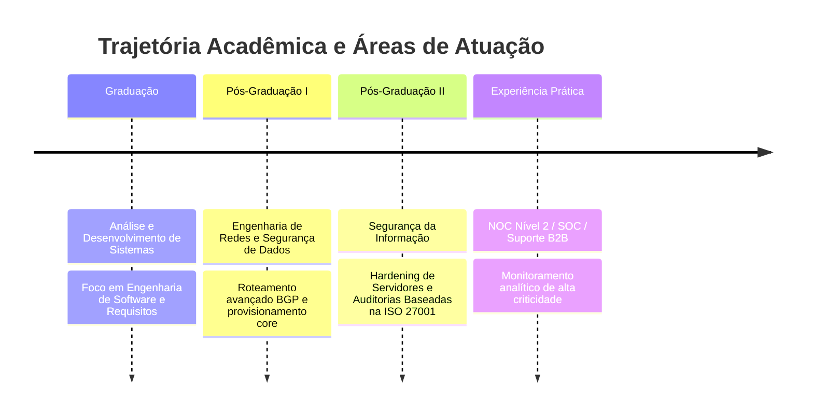

# 👋 Olá, eu sou o **Flávio Vinício Mota da Silva**
### **Analista e Desenvolvedor de Sistemas** | Especialista em Engenharia de Redes & Segurança da Informação

<p align="center">
  
</p>

---

## 🚀 Sobre Mim
Profissional sênior focado na convergência entre **Desenvolvimento de Sistemas**, **Infraestrutura de Redes** e **Segurança Cibernética**. Minha atuação é pautada na arquitetura de softwares seguros, robustos e escaláveis, integrando práticas modernas de engenharia com metodologias ágeis e governança de TI. Atuo no desenho e sustentação de ecossistemas corporativos complexos, garantindo alta disponibilidade, otimização de tráfego e conformidade normativa.

---

## 📈 Dashboard de Habilidades & Métricas

### 📊 Hard Skills
```text
Análise e Desenvolvimento de Sistemas [████████████████████████████████████████----------------] 80%
Engenharia de Redes                  [████████████████████████████████████████████------------] 85%
Infraestrutura                       [████████████████████████████████████████████------------] 85%
Segurança da Informação              [████████████████████████████████████████----------------] 80%
Banco de Dados                       [████████████████████████████████████--------------------] 70%
Cloud Computing                      [██████████████████████████████--------------------------] 60%
DevSecOps                            [██████████████████████████████--------------------------] 60%
```

### 🧠 Soft Skills
```text
Pensamento Analítico                 [███████████████████████████████████████████████████-----] 95%
Resolução de Problemas               [████████████████████████████████████████████████--------] 90%
Aprendizado Contínuo                 [███████████████████████████████████████████████████-----] 95%
Comunicação Técnico-Corporativa      [████████████████████████████████████████----------------] 80%
Organização                          [█████████████████████████████████████████████-----------] 85%
Trabalho em Equipe                   [█████████████████████████████████████████████-----------] 85%
```

---

## 🛠️ Stack Tecnológica

| Categoria | Tecnologias e Ecossistema |
| :--- | :--- |
| **Linguagens & Back-end** |       |
| **Banco de Dados** |    |
| **Nuvem & Cloud** |   |
| **Segurança & SysAdmin** |    Active Directory \| Hardening \| Nmap |
| **Infraestrutura & Redes** | Huawei \| FiberHome \| Furukawa \| **BGP** \| Telecomunicações |
| **Monitoramento & Análise** |   Wireshark \| Cisco Packet Tracer |
| **Frameworks & Compliance** | ITIL \| COBIT \| **ISO 27001** \| **LGPD** \| Metodologias Ágeis (Scrum/Kanban) |

---

## 📈 Métricas de Engenharia

<p align="center">
  
  
</p>

<p align="center">
  
</p>

> _Nota: Substitua `SEU_USUARIO_GITHUB` pelo seu username real do GitHub para ativar os coletores dinâmicos de dados._

---

## 🗺️ Linha do Tempo Profissional



### 💼 Áreas de Competência Estratégica
- **Desenvolvimento Web & Back-end:** Código estruturado sob princípios de arquitetura limpa em ecossistemas modernos.
- **Análise de Sistemas & Requisitos:** Engenharia reversa, análise preditiva e documentação técnica para alinhamento operacional.
- **NOC Avançado (Nível 2) & SOC:** Mitigação de incidentes em tempo real e orquestração de resiliência corporativa.
- **Telecom & Infraestrutura Física/Lógica:** Provisionamento de redes usando ativos críticos das linhas Huawei, FiberHome e Furukawa.

---

## 🌟 Projetos em Destaque

1. **🔒 Enterprise DevSecOps Pipeline**
   - Automação robusta de segurança em esteiras de integração contínua (CI/CD) com análise estática de vulnerabilidades estruturais.
2. **📊 Telemetry Core Engine**
   - Orquestrador inteligente de coletas integrado a APIs de roteadores BGP e ativos ópticos para plotagem dinâmica via Zabbix/Grafana.
3. **🛡️ Corporate Hardening Framework**
   - Suite de scripts automatizados de conformidade e mitigação para servidores empresariais alinhados com a ISO 27001 e a LGPD.

---

## 🐍 Git Snake Grid Animation
<p align="center">
  
</p>

---

## 🤝 Contato Profissional

<p align="center">
  <a href="https://linkedin.com" target="_blank">
    
  </a>
</p>

---
<p align="center">Desenvolvido sob padrões modernos de design e arquitetura limpa.</p>
